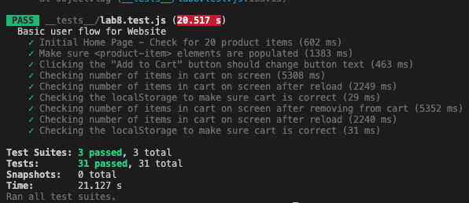

# Lab 8 - Starter

Member: Thanh Diem Nguyen

## Check your understanding:
   **1) Where would you fit your automated tests in your Recipe project development pipeline? Select one of the following and explain why.**

   I think "Within a Github action that runs whenever code is pushed" would fit my automated tests in my Recipe project development pipeline for several reasons. First, this method ensures tests' consistency and automatical when updated. These attributes can help immediately detect the bugs before reaching the main branch, minimizing the risk of integration problems.
      
      
   **2) Would you use an end to end test to check if a function is returning the correct output? (yes/no)**

   No, I think we would not use an end to end test to check if a function is returning the correct output. The end to end test is to test an application's workflow of the whole process until its termination to ensure the expectation of the integrated components, which is suitable for a unit test. It requires a more isolated test to check if a function is returning the correct output.
   
      
   **3) Would you use a unit test to test the “message” feature of a messaging application? Why or why not? For this question, assume the “message” feature allows a user to write and send a message to another user.**
   
   I think it is possible to use a unit test to test the “message” feature of a messaging application, but it is not optimal. Unit tests are often applied to isolated parts of code, such as individual methods. Whereas the "messages" feature involves multiple components working together like user's interface, database storage, etc., which is more suitable for end-to-end testing.

   **4) Would you use a unit test to test the “max message length” feature of a messaging application? Why or why not? For this question, assume the “max message length” feature prevents the user from typing more than 80 characters.**
   
   Yes, I think you can use a unit test to test the “max message length” feature of a messaging application. The "maximum message length" is a small, isolated function that can be tested independently of the rest of the system, so the unit test is appropriate in this case.

## Screenshot of all tests results from running `npm test`

- **sum.test.js & unit.test.js**
  
   

- **lab8.test.js**
  
   